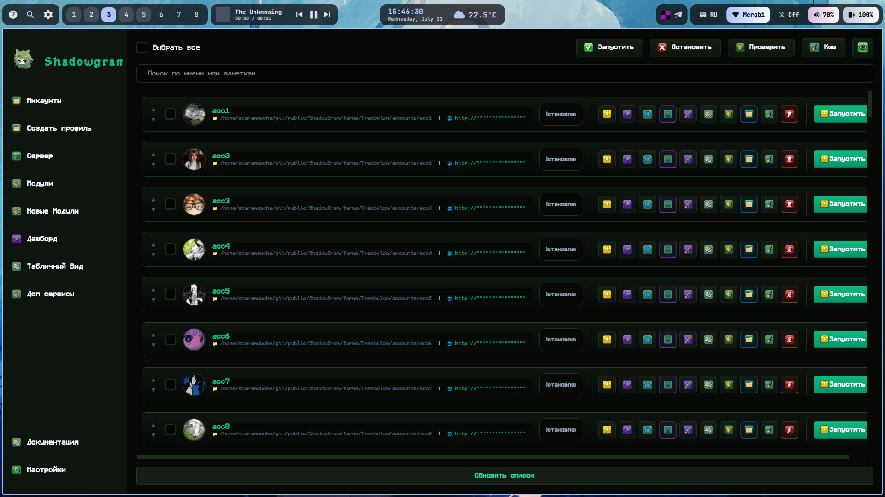

#  ShadowGram

<p align="center">
  
</p>

**ShadowGram** — это десктопное приложение для профессионального управления множеством Telegram-аккаунтов. Инструмент позволяет запускать десятки изолированных сессий с индивидуальными прокси и автоматизировать рутинные задачи через систему плагинов. Проект сочетает в себе глубокую изоляцию профилей, продвинутую систему асинхронных задач и эстетичный интерфейс на базе PyQt6.

---

## 📢 Сообщество и обновления

Следите за развитием проекта в нашем официальном Telegram-канале: [**@Shadowgramm**](https://t.me/Shadowgramm). 
В канале публикуются:
- ⚡ Анонсы, новости и релизы свежих обновлений.
- 📦 Эксклюзивные кастомные модули и плагины, которые не вошли в базовую сборку (их можно импортировать в программу в один клик через раздел Настроек).
- 🛠 Полезные советы по работе с фермами аккаунтов, обходу антифрод-систем и грамотному управлению сессиями.

Подписывайтесь, чтобы ничего не пропустить!

---

##  Основные возможности

###  Управление аккаунтами и фермами
- **Мульти-фермы:** Группируйте аккаунты по разным "фермам", каждая со своим конфигом и пулом прокси.
- **Изоляция:** Каждый профиль работает в своей директории (`workdir`), не пересекаясь с другими.
- **Менеджер прокси:** Встроенная многопоточная проверка пула прокси и их автоматическое распределение по сессиям. Поддержка прозрачной маршрутизации через `gost`.
- **Безопасность:** Индивидуальные имена устройств (Device Name) для каждой сессии и встроенный **Режим Невидимки (Stealth Mode)** для автоматического увеличения задержек и защиты от детекта.

###  Дополнительные утилиты (Встроенные сервисы)
- 🧠 **Генератор ИИ-ролей:** Создание уникальных характеров и промптов (System Instructions) для ИИ-ассистентов на базе разных тематик (Крипта, IT и т.д.).
- 👥 **Массовое создание профилей:** Регистрация пустышек и автоматическая настройка профилей пачками за пару кликов.
- 🔑 **Генератор API ID / Hash:** Безопасная генерация ключей доступа для каждого аккаунта через встроенный клиент.
- 🔄 **Конвертер TData:** Нативная конвертация папок `tdata` (Telegram Desktop) в готовые для работы Pyrogram/Hydrogram `.session` файлы.
- 📱 **Генератор Device Name:** Присвоение правдоподобных названий устройств Android/iOS для маскировки сессий.

###  Система плагинов и сценариев
Уникальная архитектура позволяет запускать сложные цепочки автоматизации прямо во время работы, без перезагрузки программы:
- **Динамические модули:** Устанавливайте кастомные Python-плагины через Drag & Drop.
- **Сценарии:** Визуальный конструктор задач (например: пауза -> прогрев -> пауза -> комментарий).
- **Параллельное выполнение:** Запуск задач на десятках аккаунтов одновременно с учетом глобальных лимитов потоков (Concurrency Limit).
- **Staggered Start:** Умные рандомные задержки между стартами аккаунтов для эмуляции поведения реальных пользователей.

###  Современный геймерский дизайн
Полностью переработанный пользовательский интерфейс с темной темой (Dark Mode), кастомными пиксельными шрифтами (Gossip, Monocraft) и плавными анимациями, вдохновленными Discord и современными играми.

### 📖 База знаний (Wiki)
В приложении реализована встроенная **интерактивная документация**. Найти её можно в разделе **Настройки -> 📖 Документация**. 
Там вы найдете подробные гайды по установке, работе с профилями, пулом прокси и написанию собственных плагинов.

---

##  Доступные плагины
*Подробную документацию по каждому модулю можно найти во встроенной Wiki или в папке [documentation/modules/](documentation/modules/).*

- 🤖 **AI Smart Commenter:** Генерация уникальных осмысленных комментариев через нейросети (с возможностью задать индивидуальный характер/промпт для каждого аккаунта).
- 💬 **Auto-Reactor:** Случайная расстановка реакций и отправка заготовленных комментариев для имитации живой активности.
-  **Smart Warmer:** Интеллектуальный прогрев профилей (вступление в чаты, чтение ленты и пересылка постов).
-  **Channel Viewer:** Массовая накрутка просмотров на посты в каналах.
-  **Privacy Guard:** Мгновенная настройка жесткой приватности аккаунтов (скрытие номера, запрет звонков).
-  **Set Avatar:** Быстрая массовая установка фото профиля.
-  **Get Auth Code:** Перехват кодов подтверждения из системного чата Telegram (777000).
-  **Session Check:** Быстрая диагностика на баны и валидация сессий с синхронизацией аватарок.

---

##  Системные зависимости

Для корректной работы функций проксирования и изоляции в системе (Linux) должны быть установлены следующие утилиты:

- **[gost](https://github.com/ginuerzh/gost):** Создание SOCKS5-туннелей для каждого аккаунта.
- **firejail:** Изоляция имен устройств и сетевого окружения (опционально, но рекомендуется).
- **proxychains-ng (proxychains4):** Форсированное проксирование трафика Telegram Desktop.
- **thunar:** Файловый менеджер для быстрого открытия папок профилей.

---

##  Установка и запуск (Arch Linux)

1. **Клонируйте репозиторий:**
   ```bash
   git clone https://github.com/scaramouche/ShadowGram.git
   cd ShadowGram
   ```

2. **Установите системные зависимости:**
   ```bash
   sudo pacman -S gost firejail proxychains-ng thunar
   ```

3. **Создайте и настройте виртуальное окружение:**
   ```bash
   python -m venv .venv
   source .venv/bin/activate
   pip install -r requirements.txt
   ```

4. **Запустите приложение:**
   ```bash
   python ShadowGram.py
   ```

---

##  Структура проекта

```text
ShadowGram/
├── ShadowGram.py          # Главная точка входа (GUI)
├── resources/             # Иконки, звуки и шрифты
├── documentation/         # Интерактивная база знаний (MD файлы)
├── src/
│   ├── core/              # Ядро системы (логика, константы, менеджер модулей)
│   ├── modules/           # Плагины автоматизации
│   └── ui/                # Интерфейс PyQt6 (страницы, окна, стили)
└── config.json            # Файл конфигурации (создается автоматически)
```

---

**Разработано с акцентом на стабильность, безопасность и удобство автоматизации. **

---

 **Отказ от ответственности:** Проект находится в стадии **бета-тестирования**. Некоторые функции могут не работать или работать некорректно. Автор не несет ответственности за возможную блокировку, утерю ваших аккаунтов Telegram или любые другие последствия, возникшие в результате использования данного программного обеспечения. **Используйте приложение исключительно на свой страх и риск.**