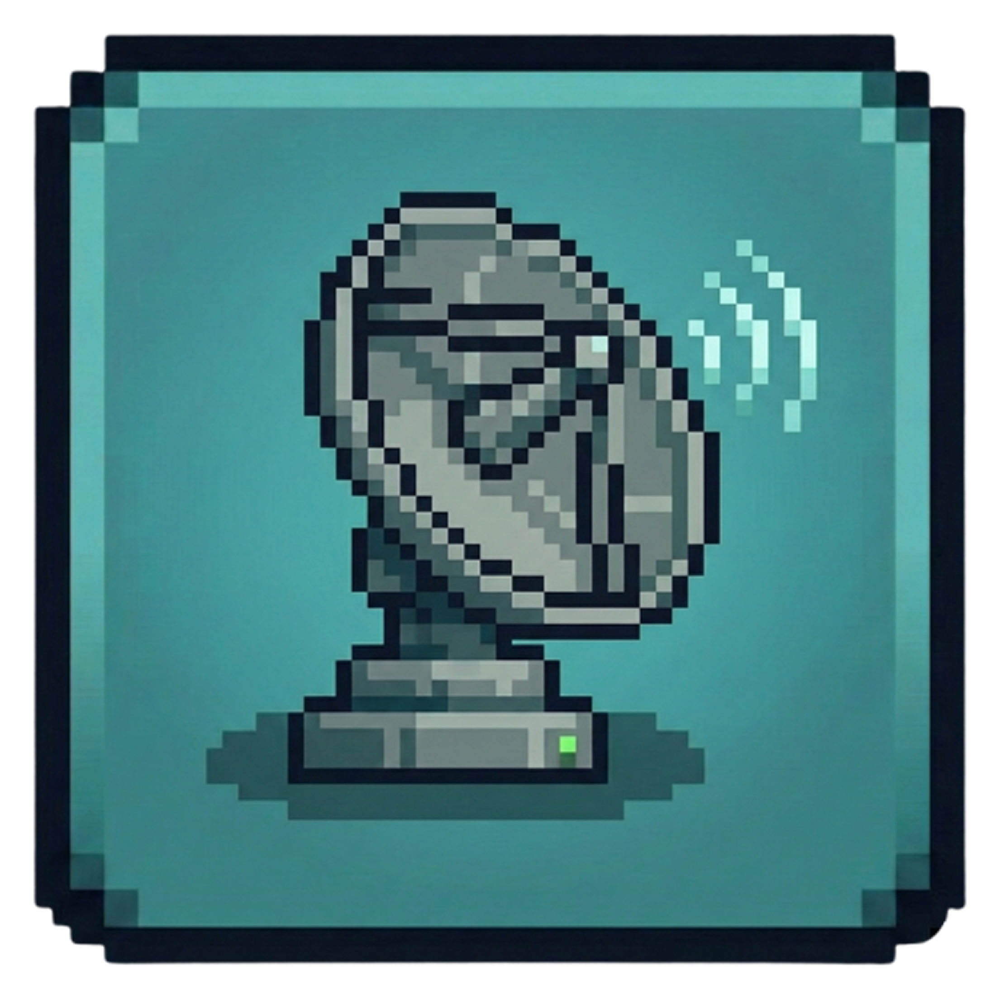
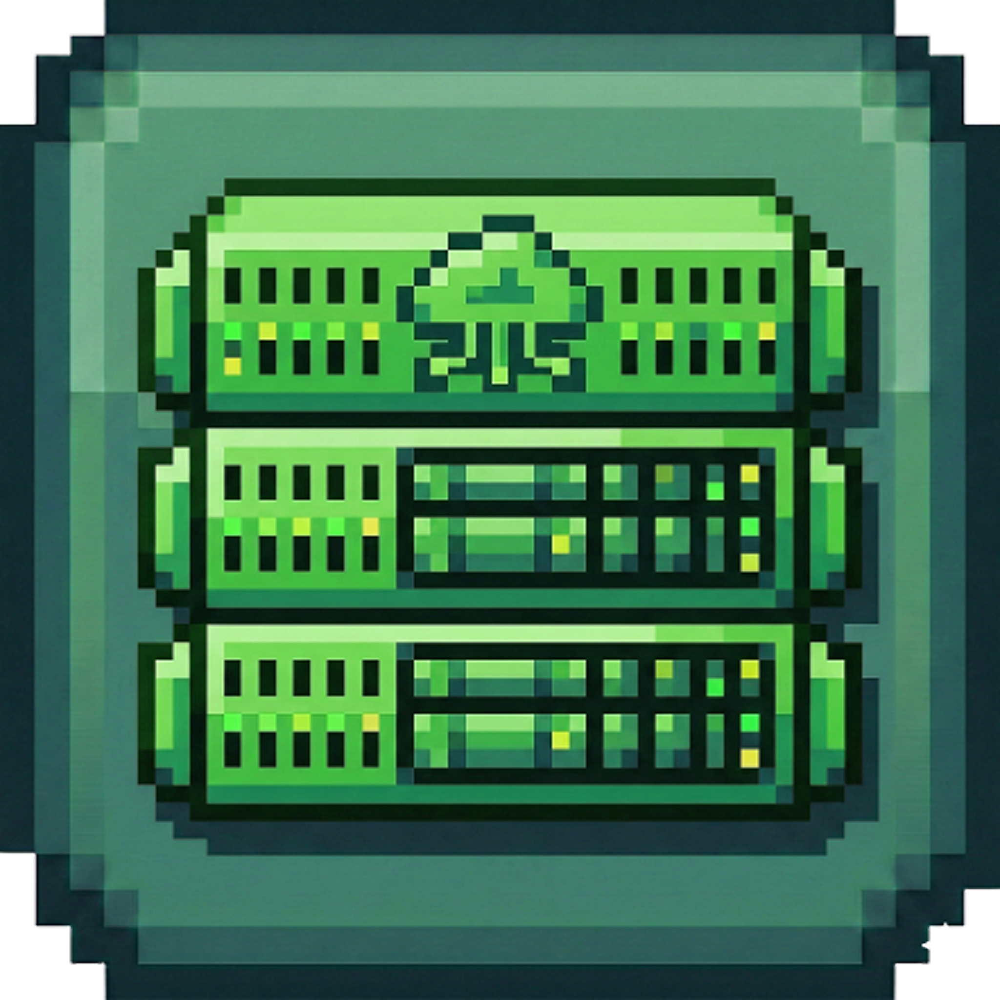
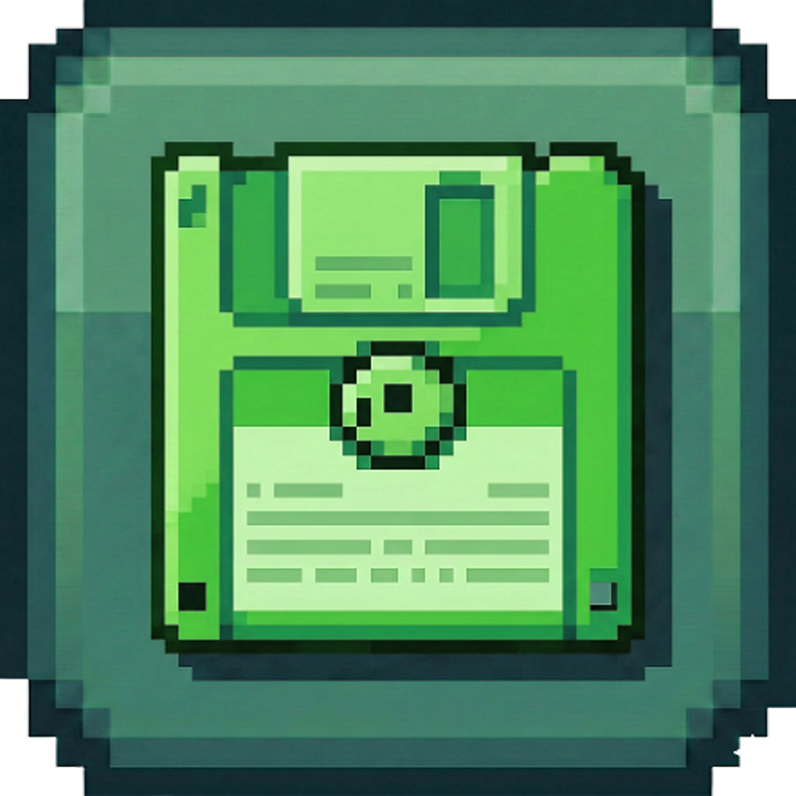
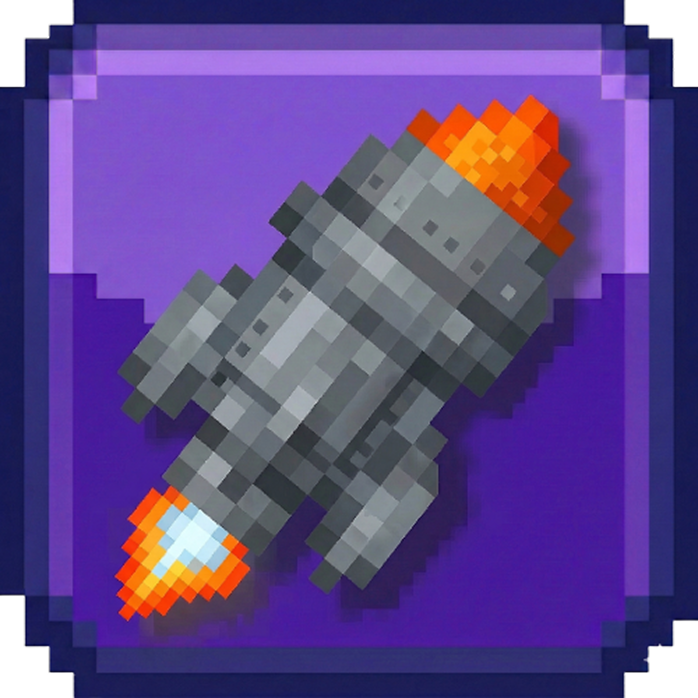

#  ShadowGram

**ShadowGram** — это высокопроизводительный инструмент для профессионального управления множеством Telegram-аккаунтов и автоматизации действий через протокол MTProto. 

Проект объединяет удобство графического интерфейса и мощь скриптов автоматизации, обеспечивая максимальный контроль над вашей сетью аккаунтов.

---

## 🚀 Основные возможности

###  Мультиаккаунтинг
Управляйте десятками и сотнями сессий одновременно. Каждая сессия изолирована в своей рабочей директории, что гарантирует сохранность данных и отсутствие конфликтов между процессами.

###  Индивидуальные Proxy
Забудьте о массовых банах. Система поддерживает привязку уникального HTTP прокси к каждому профилю. Встроенный  **Proxy Checker** поможет быстро отсеять нерабочие узлы.

###  Модульная архитектура
Расширяйте возможности приложения с помощью системы плагинов. 
*   **Просмотры**: Параллельная накрутка просмотров на посты.
*   **Прогрев**: Имитация активности реального пользователя.
*   **Авто-аватарки**: Массовая установка фото профилей.

###  Защита и Приватность
Используйте инструмент **Privacy Guard** для мгновенной настройки безопасности: скройте номер телефона, ограничьте звонки и приглашения в группы для посторонних лиц.

###  ServerGram UI
Встроенная панель управления сервером позволяет мониторить системные ресурсы, управлять удаленными процессами и поддерживать инфраструктуру в рабочем состоянии.

---

## 🛠 Почему выбирают ShadowGram?

*   **Производительность**: Асинхронная архитектура на базе `asyncio` и `hydrogram`.
*   **Простота**: Удобный Dark Mode интерфейс, не перегруженный лишними деталями.
*   **Бекапы**: Кнопка  **Экспорт ZIP** позволит сохранить все сессии и настройки в один архив.
*   **Логирование**: Подробный вывод действий каждого модуля в реальном времени.

---

 **Готовы начать?**
Перейдите к разделу **Установка**, чтобы настроить окружение и запустить вашу первую сессию!
